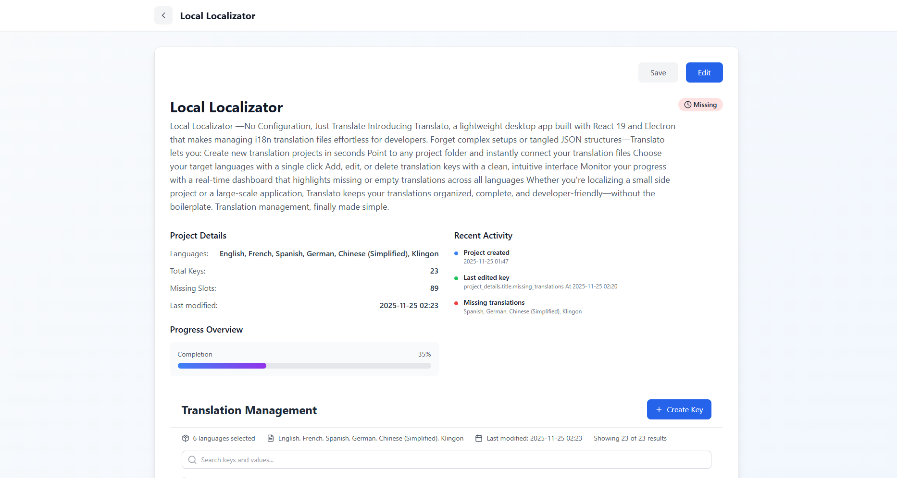
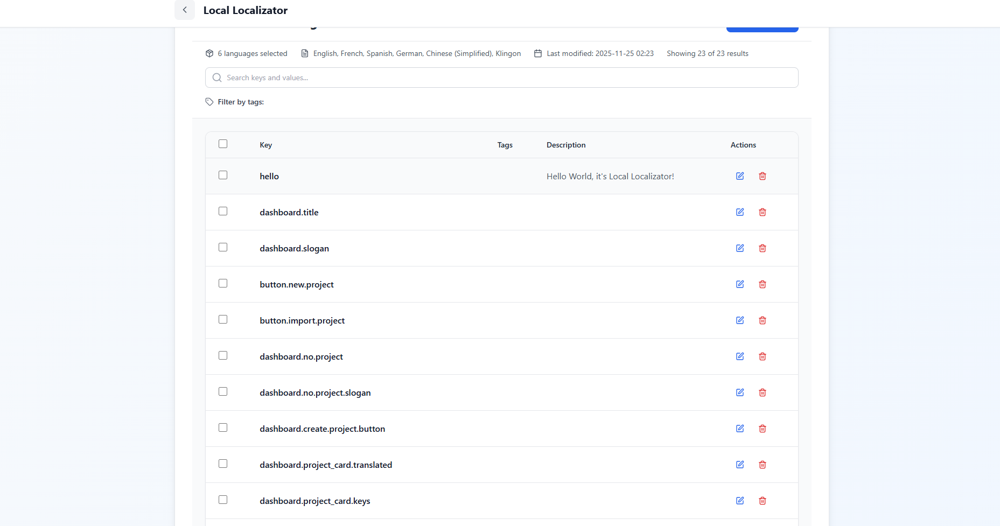
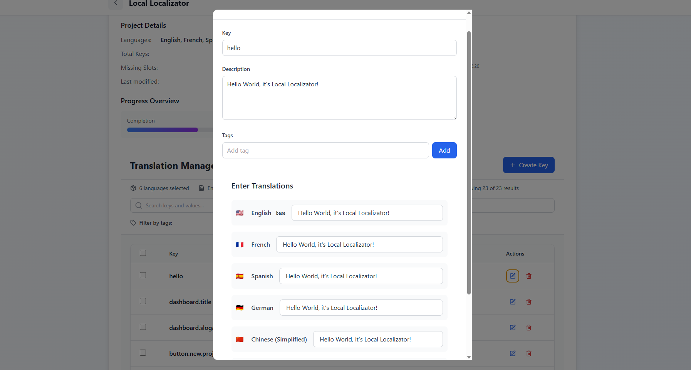
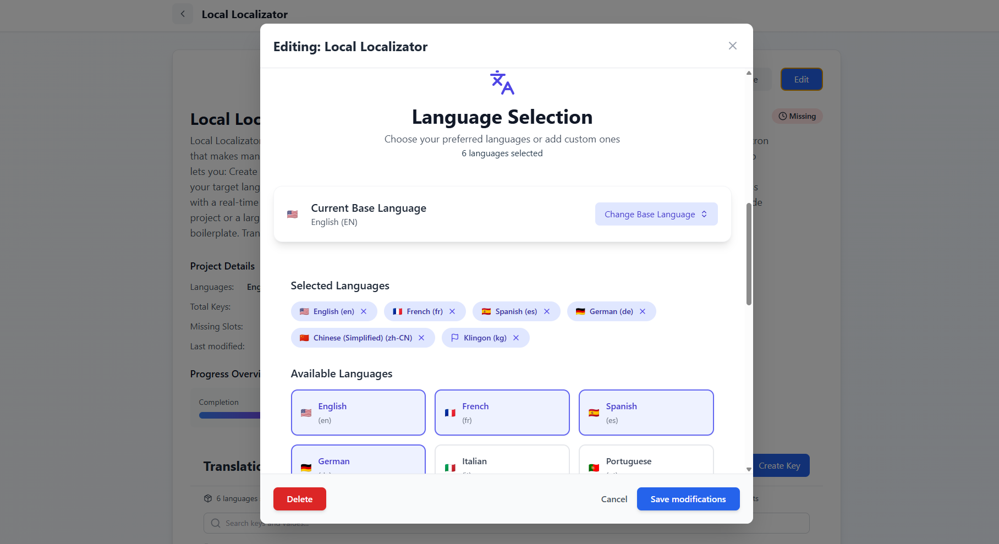

# 🌍 Local Localizator – Effortless Translation Management for Developers

> **Simplify localization. Zero config. Pure productivity.**

Local Localizator is a sleek, desktop-first translation management tool built with **React 19** and **Electron**. It empowers developers to create, edit, organize, and monitor multilingual translation files without wrestling with configuration, CLI tools, or spreadsheets.

Whether you're working on a personal project or a team-based application, Local Localizator gives you full control over your i18n workflow—in one intuitive interface.

---

## ✨ Features

- **Zero-configuration setup**: Just point to your project folder, and go.
- **Multi-language support**: Add as many languages as you need with ease.
- **CRUD operations**: Create, edit, and delete translation keys on the fly.
- **Real-time validation**: Instantly spot missing or empty translations.
- **Project dashboard**: Visual overview of translation completeness per language.
- **File format agnostic**: Works with common formats like JSON, YAML, or nested JS objects (custom parsers supported).
- **Offline-ready**: Entirely local—your data never leaves your machine.

---

## 🖥️ Screenshots






- Dashboard view showing translation coverage per language  
- Key editor with side-by-side language comparison  
- Project setup wizard

---

## 🚀 Getting Started

### Prerequisites
- Node.js (v18 or higher)
- npm or pnpm (recommended)

### Installation

1. Clone the repository:
   ```bash
   git clone https://github.com/MohKamal/local-localizator.git
   cd local-localizator
   ```

2. Install dependencies:
   ```bash
   npm install
   # or
   pnpm install
   ```

3. Start the development version:
   ```bash
   npm run dev
   ```

4. Build for production (Electron app):
   ```bash
   npm run package:win
   ```

The packaged app will be available in the `out/` directory for your OS.

---

## 🛠️ How It Works

1. **Create a Project**: Give your translation project a name.
2. **Link Your Codebase**: Select the root folder of your target application.
3. **Choose Languages**: e.g., `en`, `es`, `fr`, `ja`.
4. **Define Structure**: local localizator helps you scaffold new translation files.
5. **Edit Translations**: Use the visual editor to manage keys and values.
6. **Monitor Health**: The dashboard flags incomplete translations so nothing ships untranslated.

> 💡 **Supported Formats (by default)**:  
> - `src/locales/en.json`  
> - `public/i18n/en.json`  
> - Nested structures like `messages.welcome.title`

---

## 📥 Importing Projects & Translation Files

Local Localizator makes it easy to bring existing translation work into the app—whether you're collaborating with a team or starting from pre-built JSON files.

You can **import a full project** if it follows Local Localizator’s internal structure (e.g., exported by another user), or **create a new project from raw translation files** (like `en.json`, `fr.json`, etc.).

To get started:
1. Click **“Import** on the dashboard.
2. Select one or more JSON files from your file system.
3. The app will **auto-detect languages** based on filenames (e.g., `es.json` → Spanish).
4. Review the detected languages, and **choose a base language** by clicking the star icon ⭐.
5. Once a base language is set, the **“Validate & Create”** button becomes active.
6. Click it to generate a new project with a temporary name—you’ll be taken directly to the project editor to finalize details (name, keys, etc.).

All imported or created projects appear instantly in your dashboard, ready for editing, validation, and translation completeness tracking.

---

## 🔒 Privacy & Security

Local Localizator is **100% offline**. It never sends your code, translations, or project structure to any external server. All data stays on your machine.

---

## 🧪 Roadmap (Upcoming)

- [ ] Import/export CSV/XLIFF for external Local Localizatorrs  
- [ ] Find & replace across languages  
- [ ] Duplicate key detection  
- [ ] Collaboration mode (local network sync)  
- [ ] Plugin system for custom file parsers  
- [ ] Dark/light theme toggle

---

## 🤝 Contributing

Contributions are welcome! Whether it’s a bug fix, UX improvement, or new feature:

1. Fork the repo  
2. Create your feature branch (`git checkout -b feat/amazing-feature`)  
3. Commit your changes (`git commit -m 'Add some amazing feature'`)  
4> Push to the branch (`git push origin feat/amazing-feature`)  
5. Open a Pull Request

Please read our [Contributing Guide](CONTRIBUTING.md) for details.
Please read our [Documentation Guide](documentation.md) for documentation.

---

## 📄 License

Distributed under the MIT License. See `LICENSE` for more information.

---

## 💬 Feedback & Support

Found a bug? Have a feature idea?  
Open an [Issue](https://github.com/MohKamal/local-localizator/issues).

---

**Made with ❤️ for developers who hate missing translations.**  
*local localizator — because your users deserve to understand your app, in their language.* 🌐
